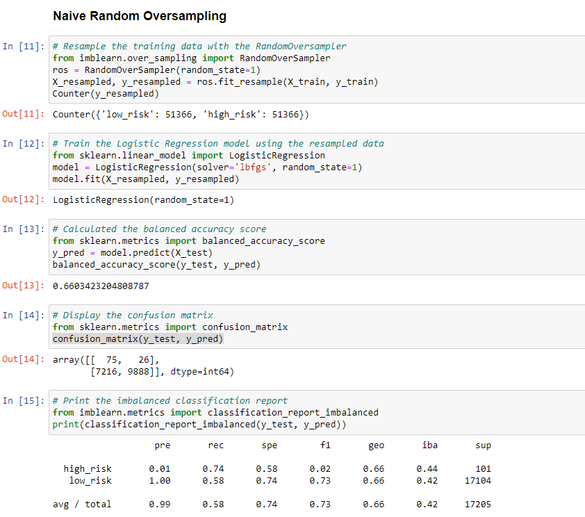
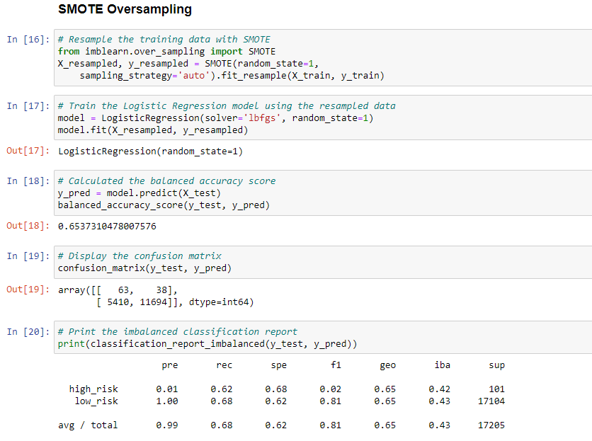
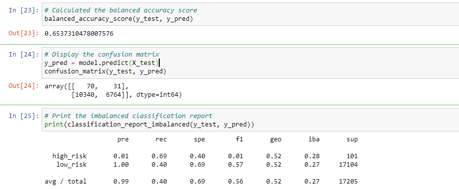
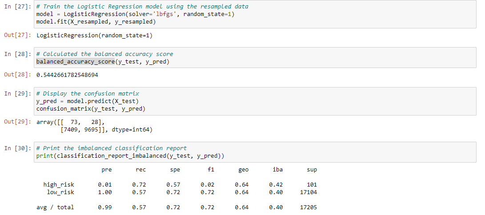
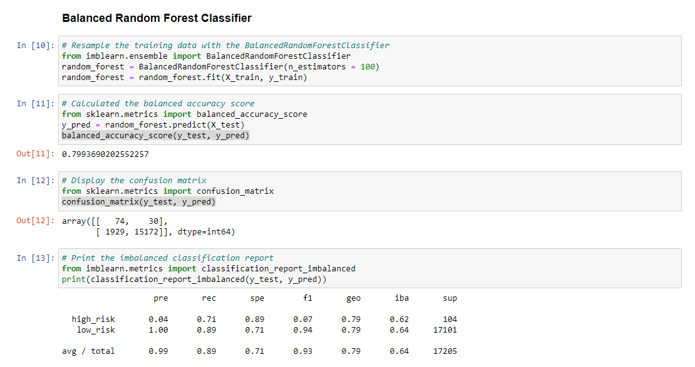
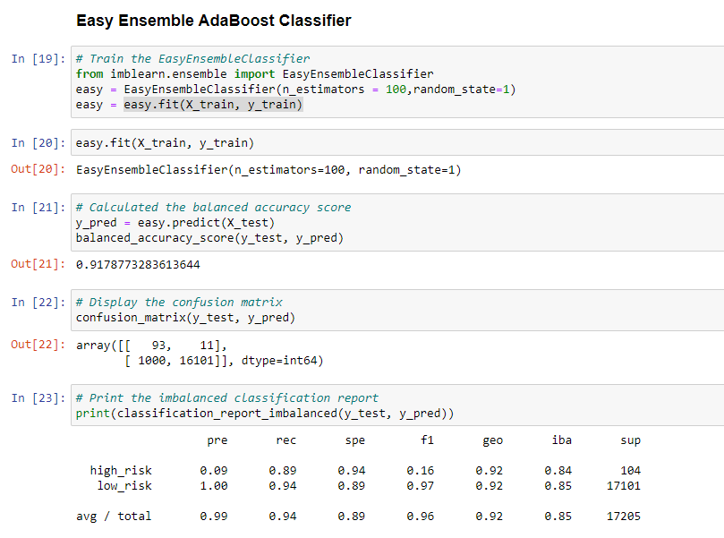

# Credit Risk Analysis

## Overview of Analysis

The purpose of this analysis is to employ techniques to train and evaluate models using resampling. Using a dataset provided from LendingClub, a peer-to-peer lending service, the data is oversampled using RandomOverSampler and SMOTE alogrithms, and undersampled using a ClusterCentroids algorithm. Then, a combinational approach of over- and undersampling is used using SMOTEENN algorithm. The learning models are then compared to predict credit risk and is finally evaluated based on their performance. This project was completed using python and Jupyter Notebook.

## Results
### Naive Random Oversampling: 
- Accuracy Score: 66%
- Precision High Risk: 1%
- Precision Low Risk: 100%
- Recall High Risk: 74%
- Recall Low Risk: 58%

### SMOTE Oversampling: 
- Accuracy Score: 65%
- Precision High Risk: 1%
- Precision Low Risk: 100%
- Recall High Risk: 62%
- Recall Low Risk: 68%

### Cluster Centroid Undersampling: 
- Accuracy Score: 65%
- Precision High Risk: 1%
- Precision Low Risk: 100%
- Recall High Risk: 69%
- Recall Low Risk: 40%

### Combination (Over and Under) Sampling: 
- Accuracy Score: 54%
- Precision High Risk: 1%
- Precision Low Risk: 100%
- Recall High Risk: 72%
- Recall Low Risk: 57%

### Balanced Random Forest Classifier: 
- Accuracy Score: 80%
- Precision High Risk: 4%
- Precision Low Risk: 100%
- Recall High Risk: 71%
- Recall Low Risk: 89%

### Easy Ensemble AdaBoost Classifier: 
- Accuracy Score: 92%
- Precision High Risk: 9%
- Precision Low Risk: 100%
- Recall High Risk: 89%
- Recall Low Risk: 94%

## Summary
Upon review of the accuracy and precision numbers from each test, its fair to say that the best model to recommended for the use of predicting credit risks is the Easy Ensemble AdaBoost Classifier as its accuracy score is 92% and the average recall is 94%.
